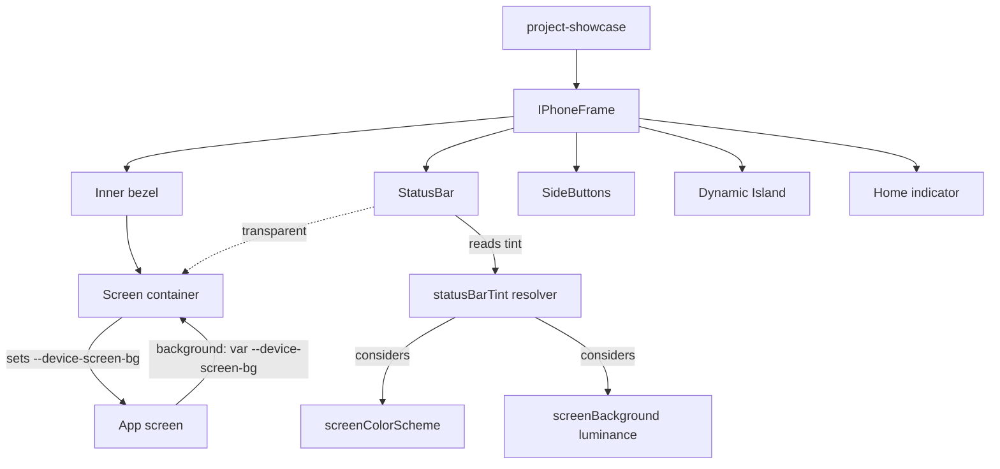
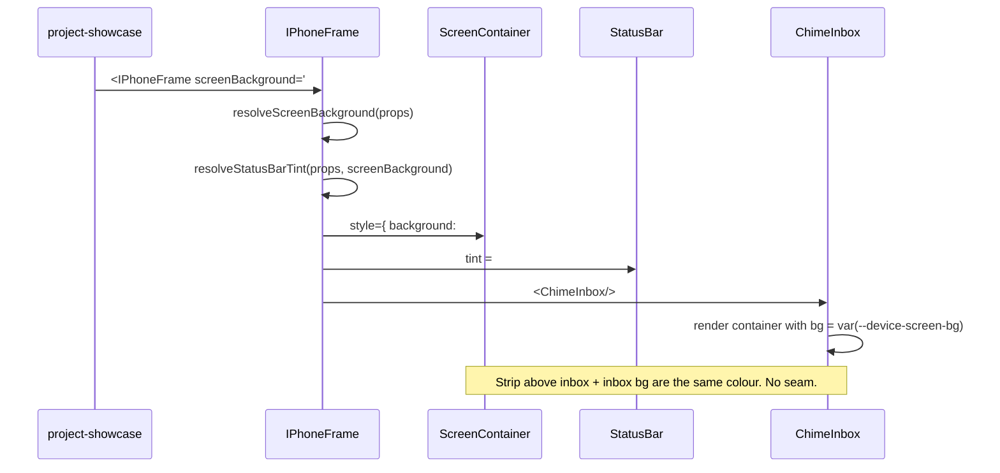
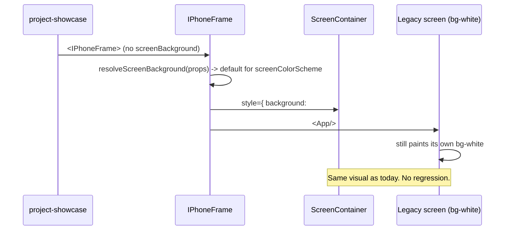

# Design Document: iPhone Frame Visual Fix

## Overview

The `IPhoneFrame` component currently shows two cosmetic problems in the rendered preview. First, the screen surface paints `#fff` while several Chime/CRM screens paint `#f2f2f7`, and because the frame reserves a status-bar strip via `paddingTop` on the screen container, the white screen background bleeds through above the app's grey background — a visible horizontal seam under the Dynamic Island. Second, the device reads as a featureless black slab: `SideButtons` renders rails roughly 2–3 px wide and only 1 px outside the frame edge, which disappears at the 240–360 px widths used on the page, and the titanium gradient lacks the inner highlight / recess line that gives the body recognisable depth.

This design fixes both problems without breaking any existing call site (`ChimeInbox`, `ChimeChat`, `ChimeCompose`, `CrmDashboard`, `CrmPipeline`, `CrmLead`, and the `project-showcase` usage). The screen-background seam is closed by introducing a single source of truth for the screen surface — a `screenBackground` prop on `IPhoneFrame` — that propagates to the screen container via a CSS custom property (`--device-screen-bg`) which app screens consume instead of painting their own background. The status bar continues to belong to device chrome but renders transparently over that shared surface, so the strip above the inbox and the inbox itself read as one continuous colour. The status-bar tint stays driven by `screenColorScheme` for backward compatibility, and a new `auto` resolver also considers the screen background's perceptual luminance so a light surface always gets a dark tint and vice versa, regardless of which screen is mounted. The body silhouette is rebuilt: side-button widths scale to 1.4–1.7% of frame width (≈5 px at 360 px), inset deeper into the rail, with iOS-correct lengths and positions for Action / Volume Up / Volume Down on the left and Side / Camera Control on the right; the rail itself gains a subtle inner highlight and a darker recess line at the bezel join for perceived depth.

The chosen direction is a `screenBackground` prop, not "let children fill the strip". The status bar still belongs to the device, not to the app — moving its background into app screens would mean every screen has to care about layout that's the frame's responsibility (status-bar height, padding, vertical alignment with the Dynamic Island), and any future change to the frame's status-bar geometry would have to be reflected in every screen. A single shared CSS variable is cleaner: app screens stop painting their own background and instead read `var(--device-screen-bg)`, so the strip and the content are guaranteed to match by construction.

## Architecture



Key change: today the screen container hard-codes `background: #fff` (or `#0a0a0b`), and each app screen paints its own `bg-[#f2f2f7]` or `bg-white`. After the change, the screen container exposes its background through a CSS variable, and screens consume that variable instead of hard-coding a colour.

## Sequence Diagrams

### Mounting a screen with grey background (Chime Inbox)



### Mounting a screen without explicit screenBackground (back-compat)



## Components and Interfaces

### Component 1: `IPhoneFrame`

**Purpose**: Render the iPhone 17 Pro Max chrome (titanium body, bezel, side buttons, status bar, Dynamic Island, home indicator) and host an app screen that fills the inner display area.

**Interface (additions only — existing props unchanged)**:

```ts
export interface IPhoneFrameProps {
  // ── existing ─────────────────────────────────────────────
  width?: number;                           // default 360
  children?: ReactNode;
  className?: string;
  style?: CSSProperties;
  showDynamicIsland?: boolean;              // default true
  showHomeIndicator?: boolean;              // default true
  showStatusBar?: boolean;                  // default true
  statusBarTint?: "auto" | "light" | "dark";// default "auto"
  screenColorScheme?: "light" | "dark";     // default "light"
  finish?: "natural" | "black" | "white";   // default "black"

  // ── new ──────────────────────────────────────────────────
  /**
   * The colour shown behind the entire screen — including the status-bar
   * strip. Any CSS <color> value (hex, rgb, oklch). When omitted, defaults
   * to "#ffffff" for screenColorScheme="light" and "#0a0a0b" for "dark",
   * which preserves today's behaviour.
   *
   * App screens should read this via `var(--device-screen-bg)` instead of
   * hard-coding their own background, so the status-bar strip and the
   * content always read as one continuous surface.
   */
  screenBackground?: string;
}
```

**Responsibilities**:
- Resolve `screenBackground` to a concrete colour and expose it on the screen container as both `background` and `--device-screen-bg`.
- Resolve `statusBarTint` — when `"auto"`, pick the colour that contrasts the resolved screen background (preferring the existing `screenColorScheme` mapping but switching when the chosen background's luminance disagrees, e.g. a dark colour passed with `screenColorScheme="light"`).
- Render side buttons with iOS-correct geometry (see *Side-Button Geometry* below).
- Render the titanium rail with an inner highlight and a darker recess line at the bezel join.

### Component 2: `SideButtons`

**Purpose**: Draw the five physical buttons on the iPhone 17 Pro Max body so the device is unambiguously recognisable.

**Interface**:

```ts
interface SideButtonsProps {
  width: number;                                       // frame width in px
  finish: NonNullable<IPhoneFrameProps["finish"]>;
  outerRadius: number;                                 // matches frame's outer radius
}
```

**Responsibilities**:
- Compute one `buttonThickness` value (1.4–1.7% of `width`, clamped to `[5, 8]` px) used by all buttons.
- Compute `buttonInset` so each button protrudes `~30%` of its thickness past the frame edge (visible without looking detached).
- Place buttons at iOS-correct positions and lengths (table below).
- Apply a per-finish base gradient and a single shared inner highlight (1 px white at 35% opacity along the centreline) for metallic feel.
- Draw the Camera Control button with a recessed glass appearance (darker centreline) on every finish, matching the real device.

### Component 3: `StatusBar` (unchanged signature, transparent background)

**Purpose**: Display 9:41, signal/wifi/battery glyphs flanking the Dynamic Island.

**Responsibilities**:
- Render with `background: transparent` so the resolved screen background shows through.
- Use the resolved tint from the parent.

## Data Models

### Model 1: Resolved screen background

```ts
type ResolvedScreenBackground = {
  /** CSS color value applied to the screen container's `background`. */
  value: string;
  /** Perceptual luminance in [0, 1] for status-bar tint resolution. */
  luminance: number;
};
```

**Validation Rules**:
- `value` must be a valid CSS `<color>` string. Hex (`#rrggbb`, `#rgb`), `rgb(...)`, `rgba(...)`, `oklch(...)`, and named colours are all accepted; invalid input should fall back to the default for `screenColorScheme` and the function should still return a valid object.
- `luminance` is computed only when the input parses as a hex/rgb colour. For non-parsable inputs (e.g. `linear-gradient(...)`, custom CSS variables), `luminance` falls back to `0.0` if `screenColorScheme === "dark"` and `1.0` if `"light"`. This keeps tint resolution deterministic without a DOM measurement.

### Model 2: Resolved status-bar tint

```ts
type StatusBarTint = "#0a0a0b" | "#f4f4f5";
```

**Validation Rules**:
- Always returns one of the two exact values used today, so existing visuals don't drift.
- Resolution order:
  1. If `statusBarTint` is `"light"` or `"dark"`, use that directly (existing behaviour).
  2. If `statusBarTint === "auto"` and `luminance >= 0.5`, return dark (`#0a0a0b`).
  3. If `statusBarTint === "auto"` and `luminance < 0.5`, return light (`#f4f4f5`).

### Model 3: Side-button geometry

| Button | Side | `top` (% of frame height) | `length` (% of frame width) | Notes |
|---|---|---|---|---|
| Action | Left | 13.5% | 6.5% | Smallest button |
| Volume Up | Left | 21.0% | 10.0% | |
| Volume Down | Left | 32.0% | 10.0% | |
| Side / Power | Right | 22.0% | 14.0% | Longest button |
| Camera Control | Right | 39.0% | 6.5% | Recessed, darker centreline |

All buttons share `thickness ≈ clamp(5, width × 0.016, 8)` px and `inset ≈ thickness × 0.3` px. At `width = 360` px this gives `thickness ≈ 6 px` and `inset ≈ 2 px`, which is clearly visible at the page's preview sizes.

### Model 4: Titanium rail finish

```ts
type RailDecoration = {
  /** Inner 1px highlight along the rail's inner edge. */
  innerHighlight: string; // e.g. "inset 0 0 0 1px rgba(255,255,255,0.18)"
  /** Darker recess line where the rail meets the inner bezel. */
  innerRecess: string;    // e.g. "inset 0 0 0 calc(var(--bezel) + 0.5px) rgba(0,0,0,0.55)"
};
```

**Validation Rules**:
- Recess line must sit just outside the bezel's outer edge so it reads as a seam, not a stroke.
- Highlight opacity ≤ 0.25 to stay subtle; we are not trying to add a chrome-mirror effect.

## Algorithmic Pseudocode

### Algorithm: `resolveScreenBackground`

```ts
function resolveScreenBackground(
  screenBackground: string | undefined,
  screenColorScheme: "light" | "dark"
): ResolvedScreenBackground
```

**Preconditions:**
- `screenColorScheme` is `"light"` or `"dark"`.
- `screenBackground` is `undefined` or a string.

**Postconditions:**
- Returns a non-null object with a usable `value` and a `luminance` in `[0, 1]`.
- When `screenBackground` is `undefined`, the returned `value` matches today's hard-coded screen background for the given `screenColorScheme`.

**Body:**

```pascal
ALGORITHM resolveScreenBackground(screenBackground, screenColorScheme)
BEGIN
  IF screenBackground = undefined THEN
    IF screenColorScheme = "light" THEN
      RETURN { value: "#ffffff", luminance: 1.0 }
    ELSE
      RETURN { value: "#0a0a0b", luminance: 0.04 }
    END IF
  END IF

  parsed ← tryParseHexOrRgb(screenBackground)
  IF parsed = null THEN
    // Non-parsable (gradient, CSS var, oklch); fall back by scheme.
    fallbackLuminance ← (screenColorScheme = "light") ? 1.0 : 0.04
    RETURN { value: screenBackground, luminance: fallbackLuminance }
  END IF

  // Standard sRGB relative luminance (WCAG).
  RETURN { value: screenBackground, luminance: relativeLuminance(parsed) }
END
```

### Algorithm: `resolveStatusBarTint`

```ts
function resolveStatusBarTint(
  statusBarTint: "auto" | "light" | "dark",
  screenColorScheme: "light" | "dark",
  background: ResolvedScreenBackground
): StatusBarTint
```

**Preconditions:**
- `background.luminance` is in `[0, 1]`.

**Postconditions:**
- When `statusBarTint` is `"light"` or `"dark"`, the result is the corresponding token (existing behaviour preserved).
- When `statusBarTint` is `"auto"`, the result contrasts the resolved background by luminance (dark text on light bg, light text on dark bg).

**Body:**

```pascal
ALGORITHM resolveStatusBarTint(statusBarTint, screenColorScheme, background)
BEGIN
  IF statusBarTint = "light" THEN RETURN "#f4f4f5"
  IF statusBarTint = "dark"  THEN RETURN "#0a0a0b"

  // statusBarTint = "auto"
  IF background.luminance >= 0.5 THEN
    RETURN "#0a0a0b"   // dark text for light background
  ELSE
    RETURN "#f4f4f5"   // light text for dark background
  END IF
END
```

### Algorithm: `computeSideButtonGeometry`

```ts
function computeSideButtonGeometry(width: number): {
  thickness: number;
  inset: number;
  buttons: ReadonlyArray<{
    side: "left" | "right";
    topPct: number;
    lengthPct: number;
    role: "action" | "volumeUp" | "volumeDown" | "side" | "cameraControl";
  }>;
}
```

**Preconditions:**
- `width >= 200` (smaller widths aren't supported by the showcase).

**Postconditions:**
- `thickness` is clamped to `[5, 8]` px.
- `inset >= 1` px.
- The five buttons in the table above are returned in order.

**Body:**

```pascal
ALGORITHM computeSideButtonGeometry(width)
BEGIN
  thickness ← clamp(round(width × 0.016), 5, 8)
  inset     ← max(1, round(thickness × 0.3))

  buttons ← [
    { side: "left",  topPct: 13.5, lengthPct: 6.5,  role: "action" },
    { side: "left",  topPct: 21.0, lengthPct: 10.0, role: "volumeUp" },
    { side: "left",  topPct: 32.0, lengthPct: 10.0, role: "volumeDown" },
    { side: "right", topPct: 22.0, lengthPct: 14.0, role: "side" },
    { side: "right", topPct: 39.0, lengthPct: 6.5,  role: "cameraControl" }
  ]

  RETURN { thickness, inset, buttons }
END
```

## Key Functions with Formal Specifications

```ts
// In iphone-frame.tsx
export function IPhoneFrame(props: IPhoneFrameProps): JSX.Element
```

**Preconditions:**
- `props.width`, when provided, is a positive number.
- `props.screenBackground`, when provided, is a string.

**Postconditions:**
- The screen container's inline style sets both `background` and `--device-screen-bg` to the resolved value.
- When `screenBackground` is omitted, the rendered output is visually identical to today's behaviour for the given `screenColorScheme`.
- `StatusBar` renders with `background: transparent`, so no opaque strip exists between the Dynamic Island and the children.
- The five `SideButtons` are visible: each has `width >= 5 px` and protrudes from the frame edge by `>= 1 px` at any `width >= 200`.

```ts
function StatusBar(props: { tint: string; top: number; height: number; islandWidth: number; fontPx: number; }): JSX.Element
```

**Preconditions:**
- `tint` is a CSS colour.

**Postconditions:**
- The element's computed `background-color` is `rgba(0,0,0,0)` (transparent).

```ts
function SideButtons(props: { width: number; finish: Finish; outerRadius: number; }): JSX.Element
```

**Preconditions:**
- `width >= 200`.

**Postconditions:**
- Renders exactly five button rails matching `computeSideButtonGeometry(width).buttons` in order.
- Camera Control's gradient differs from the others: it has a darker centreline regardless of `finish`.

## Example Usage

```tsx
// Chime inbox — grey background, dark status-bar text.
<IPhoneFrame width={320} screenBackground="#f2f2f7">
  <ChimeInbox />
</IPhoneFrame>

// Chime chat — white background, dark status-bar text.
<IPhoneFrame width={320} screenBackground="#ffffff">
  <ChimeChat />
</IPhoneFrame>

// Legacy call site — works unchanged.
<IPhoneFrame width={phoneWidth} finish="black">
  <ActiveScreen />
</IPhoneFrame>

// Dark app demo — light status-bar text picked automatically.
<IPhoneFrame
  width={320}
  screenColorScheme="dark"
  screenBackground="#0a0a0b"
>
  <DarkAppShell />
</IPhoneFrame>
```

App-screen authors update their root container:

```tsx
// Before
<div className="flex h-full flex-col bg-[#f2f2f7] text-[#0a0a0b]">…</div>

// After
<div
  className="flex h-full flex-col text-[#0a0a0b]"
  style={{ background: "var(--device-screen-bg, #f2f2f7)" }}
>…</div>
```

The `var(--device-screen-bg, #f2f2f7)` fallback means a screen rendered without `IPhoneFrame` (e.g. a bare snapshot) still looks correct.

## Correctness Properties

*A property is a characteristic or behavior that should hold true across all valid executions of a system — essentially, a formal statement about what the system should do. Properties serve as the bridge between human-readable specifications and machine-verifiable correctness guarantees.*

### Property 1: Unified screen surface

*For any* mounted `IPhoneFrame` and any descendant element that consumes `var(--device-screen-bg)` to paint its background, the rendered colour of the status-bar strip (the rectangle from the screen's top edge down to the bottom of the Dynamic Island row) is the same RGB value as that descendant's background.

**Validates: Requirements 1.1, 1.2, 1.3**

### Property 2: Status-bar tint contrasts the screen background under `auto`

*For any* `screenBackground` whose perceptual luminance ≥ 0.5, when `statusBarTint === "auto"`, the resolved tint is `#0a0a0b`; for any `screenBackground` whose perceptual luminance < 0.5, the resolved tint is `#f4f4f5`.

**Validates: Requirements 4.1, 4.2**

### Property 3: Backwards-compatible defaults

*For any* call site that does not pass `screenBackground`, the rendered screen background equals `#ffffff` when `screenColorScheme === "light"` and `#0a0a0b` when `screenColorScheme === "dark"` — the same values used today, and the Screen_Container still exposes `--device-screen-bg` set to that default.

**Validates: Requirements 3.1, 3.2, 3.3**

### Property 4: Side buttons are visible at supported widths

*For any* `width` in `[200, 600]` px, every rail returned by `computeSideButtonGeometry(width)` has `thickness >= 5 px` and `inset >= 1 px`, and the five buttons are placed at the iOS-correct positions defined in the geometry table.

**Validates: Requirements 2.1, 2.2**

### Property 5: Five buttons, in order

*For any* `width >= 200`, `SideButtons` renders exactly five rail elements whose roles, in DOM order, are `action`, `volumeUp`, `volumeDown`, `side`, `cameraControl`.

**Validates: Requirements 2.3**

### Property 6: Camera Control reads as recessed

*For any* `finish`, the Camera Control rail's centreline colour is darker than the same finish's other right-side rail's centreline colour.

**Validates: Requirements 2.4**

## Error Handling

### Error Scenario 1: `screenBackground` is an invalid CSS colour

**Condition**: The string passed to `screenBackground` is not parsable as a CSS `<color>` (e.g. typo, non-string, or an entire gradient).
**Response**: The resolver still returns a `ResolvedScreenBackground`. `value` is set to the user-supplied string (the browser ignores invalid `background` values and falls back to the inherited default — visually no worse than today). `luminance` falls back to `1.0` for `screenColorScheme="light"` and `0.04` for `"dark"` so the tint stays sensible.
**Recovery**: No runtime exception. Logged to console only in dev (via `process.env.NODE_ENV !== "production"`) so authors notice typos.

### Error Scenario 2: `width` is below the supported range

**Condition**: `width < 200`.
**Response**: All `Math.max` clamps in geometry calculations still apply, so buttons remain ≥ 5 px thick. Visuals may compress but nothing renders broken.
**Recovery**: None needed — the showcase never passes widths below 240.

### Error Scenario 3: Legacy screen still hard-codes its own background

**Condition**: An app screen that has not yet been migrated still paints `bg-white` or `bg-[#f2f2f7]` directly.
**Response**: The screen renders with that hard-coded colour. If it matches `screenBackground` (or its default), no seam appears. If it differs, the seam reappears — but only for that screen, not globally.
**Recovery**: Migration is per-screen and idempotent: changing the screen's root to `var(--device-screen-bg)` removes the seam without further frame changes.

## Testing Strategy

### Unit Testing Approach

Pure helpers (`resolveScreenBackground`, `resolveStatusBarTint`, `computeSideButtonGeometry`) are extracted to a sibling file (e.g. `iphone-frame.helpers.ts`) and unit-tested in isolation. Component-level tests use React Testing Library to assert that:

- The screen container's inline style includes the expected `--device-screen-bg`.
- The status bar element has `background-color: transparent` in its computed style.
- Five elements with `data-iphone-button` exist, and their `data-iphone-button` values are the five expected roles in order.

### Property-Based Testing Approach

Property tests cover the helpers, where a small input domain produces a large behaviour space (any colour string, any width).

**Property Test Library**: `fast-check` (already idiomatic in TypeScript projects; no extra runtime deps needed).

Properties to implement:
- **Property 2** (auto-tint contrast): `fc.tuple(fc.hexaString({ minLength: 6, maxLength: 6 }), fc.constantFrom("light", "dark"))` → resolve background → resolve tint → assert luminance/tint relationship.
- **Property 3** (defaults): `fc.constantFrom("light", "dark")` → assert resolver's `value` matches the legacy hard-coded default when `screenBackground` is `undefined`.
- **Property 4** (button visibility): `fc.integer({ min: 200, max: 600 })` → `computeSideButtonGeometry(width)` → assert `thickness >= 5`, `inset >= 1`, and exactly five buttons in the expected role order.

### Integration Testing Approach

A single visual snapshot per screen background scenario (white, grey, dark) captures the strip+content seam. A second snapshot per `finish` confirms button visibility. These are integration-style and not run inside the property loop because they exercise full DOM rendering.

## Performance Considerations

Helpers are pure and called once per render. Adding a CSS variable to inline `style` is a one-property mutation with no measurable cost. The seam fix removes one ambiguous repaint region (status bar over white over grey) but doesn't change layer count. Side-button rails grow from ~2 px to ~6 px and add one extra `box-shadow` — still trivial; the frame already paints a 5-shadow stack on the container. No new animations are introduced.

## Security Considerations

`screenBackground` lands in inline `style` and as a CSS custom property value. Both are CSS-only sinks — there's no way to escape into JavaScript via a malformed colour string. The browser parses CSS values defensively. No new attack surface.

## Dependencies

- React (existing).
- `fast-check` for property-based tests (devDependency only). Add it as part of task 2 if it's not already installed.
- No new runtime dependencies. No changes to Tailwind config required; the `var(--device-screen-bg)` reference resolves at runtime.
