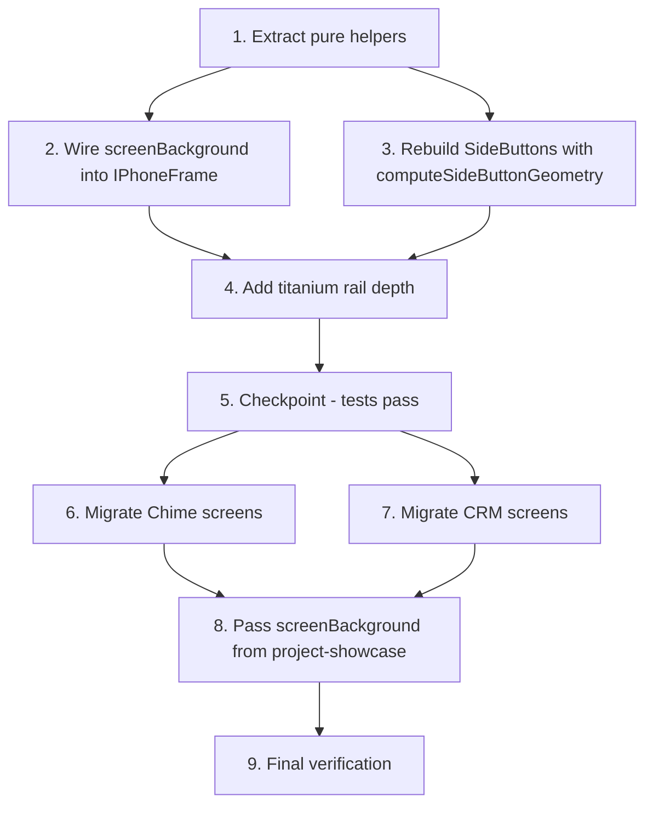

# Implementation Plan: iPhone Frame Visual Fix

This plan turns the design at `.kiro/specs/iphone-frame-visual-fix/design.md` into incremental code-change tasks. Every task names the files to edit, lists the EARS requirement IDs from `requirements.md` it satisfies, and is independently runnable. Sub-tasks marked with `*` are optional property-based or component tests; they can be skipped for an MVP.

## Overview

Implementation language: **TypeScript** (Next.js 16 + React 19 + Tailwind 4). Work proceeds in five layers:

1. Pure helpers (`tryParseHexOrRgb`, `relativeLuminance`, `resolveScreenBackground`, `resolveStatusBarTint`, `computeSideButtonGeometry`).
2. Wire `screenBackground` into `IPhoneFrame`, rebuild `SideButtons`, and add titanium rail depth.
3. Migrate the six existing app screens (Chime, CRM) to read `var(--device-screen-bg, <fallback>)`.
4. Thread `screenBackground` through `project-showcase.tsx` keyed off the active screen.
5. Verify with lint, typecheck, and the test suite.

## Tasks

- [x] 1. Extract pure helpers into `src/components/ui/iphone-frame.helpers.ts`
  - Create the file and export the following pure functions plus their supporting types:
    - `tryParseHexOrRgb(input: string): { r: number; g: number; b: number } | null` — accepts `#rgb`, `#rrggbb`, `rgb(r,g,b)`, `rgba(r,g,b,a)` (alpha ignored, whitespace tolerant). Returns `null` for gradients, `oklch(...)`, `var(...)`, named colours, and any malformed input. Fractional rgb components round and clamp to `[0, 255]`.
    - `relativeLuminance(rgb): number` — WCAG sRGB relative luminance in `[0, 1]`. Implements `lin(c) = c <= 0.03928 ? c/12.92 : ((c + 0.055)/1.055)**2.4` and `L = 0.2126·R + 0.7152·G + 0.0722·B`.
    - `resolveScreenBackground(screenBackground, screenColorScheme)` — `undefined` → `{ value: "#ffffff", luminance: 1.0 }` for `"light"`, `{ value: "#0a0a0b", luminance: 0.04 }` for `"dark"`. Parsable input → `{ value, luminance: relativeLuminance(parsed) }`. Non-parsable input → `{ value, luminance: 1.0 | 0.04 }` keyed by `screenColorScheme`.
    - `resolveStatusBarTint(statusBarTint, screenColorScheme, background)` — `"light"` → `"#f4f4f5"`, `"dark"` → `"#0a0a0b"`, `"auto"` → `"#0a0a0b"` when `background.luminance >= 0.5` else `"#f4f4f5"`.
    - `computeSideButtonGeometry(width)` — `thickness = clamp(round(width * 0.016), 5, 8)`, `inset = max(1, round(thickness * 0.3))`, and the five buttons in DOM order `action, volumeUp, volumeDown, side, cameraControl` with the `side`/`topPct`/`lengthPct` values from the design's geometry table.
  - Export types `ResolvedScreenBackground`, `StatusBarTint`, `SideButtonRole`.
  - Helpers must be pure: no React imports, no DOM access, no module-level state.
  - _Requirements: 1.2, 2.1, 2.2, 2.3, 3.1, 3.2, 3.3, 4.1, 4.2, 4.3, 4.4, 4.5_

  - [x] 1.1 Configure the Vitest property-test runner
    - Install pinned devDependencies: `vitest`, `@vitejs/plugin-react`, `@testing-library/react`, `@testing-library/jest-dom`, `@testing-library/user-event`, `jsdom`, `fast-check`.
    - Add `vitest.config.ts` (jsdom environment, React plugin, `@/* → ./src/*` alias, `setupFiles: ["./vitest.setup.ts"]`, `include: ["src/**/*.{test,spec}.{ts,tsx}"]`).
    - Add `vitest.setup.ts` with `import "@testing-library/jest-dom/vitest"`.
    - Add `package.json` scripts `"test": "vitest run"` and `"test:watch": "vitest"`.
    - Verify `npx vitest run --passWithNoTests`, `npm run lint`, and `npx tsc --noEmit` all exit clean.
    - _Requirements: 1.2, 4.1, 4.2_

  - [x] 1.2 Property test for `resolveStatusBarTint` (auto-tint contrast)
    - File: `src/components/ui/iphone-frame.helpers.test.ts`.
    - Generator: `fc.tuple(fc.hexaString({ minLength: 6, maxLength: 6 }), fc.constantFrom("light", "dark"))`. For each `(hex, scheme)`, build `bg = resolveScreenBackground("#" + hex, scheme)` and assert: `bg.luminance >= 0.5` ⇒ `resolveStatusBarTint("auto", scheme, bg) === "#0a0a0b"`; otherwise `=== "#f4f4f5"`.
    - At least 100 iterations.
    - **Property 2** in design.md. _Validates: Requirements 4.1, 4.2_

  - [x] 1.3 Property test for `resolveScreenBackground` (backwards-compatible defaults)
    - File: `src/components/ui/iphone-frame.helpers.test.ts`.
    - For `scheme ∈ ["light", "dark"]`, assert `resolveScreenBackground(undefined, scheme).value === ("#ffffff" | "#0a0a0b")` and that the returned `luminance` is consistent with that value (`1.0` for white, `0.04` for the near-black `#0a0a0b`).
    - **Property 3** in design.md. _Validates: Requirements 3.1, 3.2, 3.3_

  - [x] 1.4 Property test for `computeSideButtonGeometry` (visible side buttons)
    - File: `src/components/ui/iphone-frame.helpers.test.ts`.
    - Generator: `fc.integer({ min: 200, max: 600 })`. Assert `thickness >= 5`, `inset >= 1`, `buttons.length === 5`, and the `side`/`topPct`/`lengthPct`/`role` of each entry matches the design's geometry table verbatim.
    - At least 100 iterations.
    - **Property 4** in design.md. _Validates: Requirements 2.1, 2.2_

  - [x] 1.5 Edge-case unit tests for `tryParseHexOrRgb` and `resolveScreenBackground`
    - File: `src/components/ui/iphone-frame.helpers.test.ts`.
    - Parsable inputs (return non-null): `"#fff"`, `"#FFFFFF"`, `"rgb(10, 20, 30)"`, `"rgba(10, 20, 30, 0.5)"` (alpha ignored), `"  #abc  "` (whitespace tolerated).
    - Non-parsable inputs (return `null`): `"linear-gradient(...)"`, `"oklch(0.5 0.1 200)"`, `"red"`, `"var(--whatever)"`, `""`, `"not a color"`.
    - For each non-parsable input, assert `resolveScreenBackground(input, "light").luminance === 1.0` and `resolveScreenBackground(input, "dark").luminance === 0.04`.
    - _Validates: Requirement 4.5_

- [x] 2. Wire `screenBackground` and helpers into `IPhoneFrame`
  - File: `src/components/ui/iphone-frame.tsx`.
  - Add `screenBackground?: string` to `IPhoneFrameProps`. Document it.
  - Replace the inline `tint` calculation with `resolveStatusBarTint(statusBarTint, screenColorScheme, resolved)` where `resolved = resolveScreenBackground(screenBackground, screenColorScheme)`.
  - Update `screenStyle` to set both `background: resolved.value` and the CSS custom property `--device-screen-bg` to the same value (use a typed cast for the custom property: `style: { ..., ["--device-screen-bg" as string]: resolved.value }`).
  - Update `<StatusBar>` to render with an explicit `background: "transparent"` on its inline style so the computed `background-color` is `rgba(0, 0, 0, 0)`.
  - Preserve all current behaviour: `width`, `showDynamicIsland`, `showHomeIndicator`, `showStatusBar`, `screenColorScheme`, `finish`, `style`, `className`. Do not change `frameThickness`, `bezelThickness`, `outerRadius`, `screenRadius`, `screenWidth`, `islandWidth`, `islandHeight`, `islandTop`, `statusBarTop`, `statusBarHeight`, the screen `paddingTop` formula, or `homeIndicatorBottom`.
  - Verify with `npx tsc --noEmit` and `npm run lint`.
  - _Requirements: 1.1, 1.2, 1.3, 3.1, 3.2, 3.3, 4.1, 4.2, 4.3, 4.4, 4.5, 6.1, 6.2_

  - [x] 2.1 Component test for screen-container CSS variable + transparent status bar
    - File: `src/components/ui/iphone-frame.test.tsx`.
    - Render `<IPhoneFrame screenBackground="#abcdef"><div data-testid="child" /></IPhoneFrame>`.
    - Locate `[data-device-screen]`. Assert its inline `style.background` includes `"#abcdef"` and `style.getPropertyValue("--device-screen-bg") === "#abcdef"`.
    - Locate the StatusBar element (the descendant containing the time text `9:41`). Assert `getComputedStyle(el).backgroundColor === "rgba(0, 0, 0, 0)"`.
    - **Property 1** in design.md. _Validates: Requirements 1.1, 1.2, 1.3_

  - [x] 2.2 Regression test for layout invariants
    - File: `src/components/ui/iphone-frame.test.tsx`.
    - Render `<IPhoneFrame width={360} />`. Compute the expected screen `paddingTop` from `statusBarTop + statusBarHeight + Math.round(360 * 0.012)` using the same formulas as the component, then assert the inline `paddingTop` on `[data-device-screen]` matches.
    - Assert the StatusBar element's inline `top` and `height` equal the documented `islandTop` and `islandHeight` for `width = 360`.
    - _Validates: Requirements 6.1, 6.2_

- [x] 3. Rebuild `SideButtons` using `computeSideButtonGeometry`
  - File: `src/components/ui/iphone-frame.tsx`.
  - Replace the `SideButtons` body with one driven by `computeSideButtonGeometry(width)`. For each rail:
    - `<div aria-hidden data-iphone-button={role}>` with `position: "absolute"`.
    - Side offset: `left: -inset` for `side === "left"`, `right: -inset` for `side === "right"`.
    - `top: \`${topPct}%\``, `height: \`${lengthPct}%\``, `width: thickness`, `borderRadius: thickness`.
    - `background`: per-finish base gradient.
    - `boxShadow`: shared inner highlight `inset 0 0 0 1px rgba(255,255,255,0.35)` plus a subtle outer shadow `0 0.5px 0 rgba(0,0,0,0.5)`.
  - Per-finish base gradients:
    - `natural`: `linear-gradient(to right, #6e7075 0%, #9c9ea2 50%, #6e7075 100%)`
    - `black`: `linear-gradient(to right, #18181b 0%, #2e2e31 50%, #18181b 100%)`
    - `white`: `linear-gradient(to right, #b8b8bc 0%, #dededf 50%, #b8b8bc 100%)`
  - Camera Control override (regardless of `finish`): `linear-gradient(to right, #0a0a0c 0%, #1f1f22 30%, #3a3a3e 50%, #1f1f22 70%, #0a0a0c 100%)`.
  - Update the `SideButtons` props interface to `{ width: number; finish: NonNullable<IPhoneFrameProps["finish"]>; outerRadius: number }`. Pass `outerRadius` from `IPhoneFrame`. Mark it `void` or comment it as reserved if unused this iteration.
  - Verify with `npx tsc --noEmit` and `npm run lint`.
  - _Requirements: 2.1, 2.2, 2.3, 2.4_

  - [x] 3.1 Component test for the five buttons in order
    - File: `src/components/ui/iphone-frame.test.tsx`.
    - Render `<IPhoneFrame width={360} />`. Query `[data-iphone-button]`. Assert `length === 5` and `Array.from(els).map(el => el.dataset.iphoneButton)` deep-equals `["action", "volumeUp", "volumeDown", "side", "cameraControl"]`.
    - **Property 5** in design.md. _Validates: Requirement 2.3_

  - [x] 3.2 Property test for Camera Control darker centreline
    - File: `src/components/ui/iphone-frame.test.tsx`.
    - For each `finish ∈ ["natural", "black", "white"]`, render `<IPhoneFrame finish={finish} width={360} />`. Read `style.background` of `[data-iphone-button="cameraControl"]` and `[data-iphone-button="side"]`. Parse the `50%` mid-stop hex with `tryParseHexOrRgb` and compute its `relativeLuminance`. Assert `cameraLuminance < sideLuminance`.
    - **Property 6** in design.md. _Validates: Requirement 2.4_

- [x] 4. Add titanium rail depth to the frame container
  - File: `src/components/ui/iphone-frame.tsx`.
  - Extend `containerStyle.boxShadow` to include both:
    - Inner highlight: `inset 0 0 0 1px rgba(255,255,255,0.18)`.
    - Bezel-join recess: `inset 0 0 0 ${frameThickness}px rgba(0,0,0,0.55)`.
  - Keep the existing five entries. Order the stack so the highlight reads on top of the gradient and the recess sits at the rail/bezel boundary.
  - Verify with `npx tsc --noEmit` and `npm run lint`.
  - _Requirements: 2.5_

  - [x] 4.1 Unit test for titanium rail decoration
    - File: `src/components/ui/iphone-frame.test.tsx`.
    - Render `<IPhoneFrame />`. Read the frame container's inline `style.boxShadow`. Assert it contains `"inset 0 0 0 1px rgba(255,255,255,0.18)"` and a substring matching `inset 0 0 0 \\d+px rgba(0,0,0,0.55)`.
    - _Validates: Requirement 2.5_

- [x] 5. Checkpoint — chrome layer green
  - Run `npm run lint`, `npx tsc --noEmit`, and `npm test`. All three must exit 0 before proceeding.

- [x] 6. Migrate Chime screens to consume `var(--device-screen-bg)`
  - File: `src/components/portfolio/phone-screens/chime-screens.tsx`.
  - `ChimeInbox` root: drop `bg-[#f2f2f7]`, add `style={{ background: "var(--device-screen-bg, #f2f2f7)" }}`.
  - `ChimeChat` root: drop `bg-white`, add `style={{ background: "var(--device-screen-bg, #ffffff)" }}`.
  - `ChimeCompose` root: drop `bg-white`, add `style={{ background: "var(--device-screen-bg, #ffffff)" }}`.
  - Each fallback colour matches the screen's previous hard-coded background so the screen renders correctly when mounted outside `IPhoneFrame`.
  - _Requirements: 5.1, 5.2_

- [x] 7. Migrate CRM screens to consume `var(--device-screen-bg)`
  - File: `src/components/portfolio/phone-screens/crm-screens.tsx`.
  - `CrmDashboard`, `CrmPipeline`, `CrmLead` roots: drop `bg-[#f2f2f7]` from each, add `style={{ background: "var(--device-screen-bg, #f2f2f7)" }}`.
  - _Requirements: 5.1, 5.2_

  - [x] 7.1 Unit test for migrated screen backgrounds
    - File: `src/components/portfolio/phone-screens/screens.test.tsx`.
    - For each of `ChimeInbox` (`#f2f2f7`), `ChimeChat` (`#ffffff`), `ChimeCompose` (`#ffffff`), `CrmDashboard` (`#f2f2f7`), `CrmPipeline` (`#f2f2f7`), `CrmLead` (`#f2f2f7`): render the component in isolation, locate the root element, and assert its inline `style.background === "var(--device-screen-bg, <fallback>)"` with the matching fallback hex.
    - _Validates: Requirements 5.1, 5.2_

- [x] 8. Pass `screenBackground` from `project-showcase.tsx` through `IPhoneFrame`
  - File: `src/components/portfolio/phone-screens/index.tsx`.
    - Extend the `PhoneScreen` type to `{ id: string; label: string; Component: ComponentType; screenBackground: string }`.
    - Set `screenBackground` on each entry of `phoneScreensByProject`:
      - `chime`: `inbox` → `"#f2f2f7"`, `chat` → `"#ffffff"`, `compose` → `"#ffffff"`.
      - `crm`: `dashboard` → `"#f2f2f7"`, `pipeline` → `"#f2f2f7"`, `lead` → `"#f2f2f7"`.
  - File: `src/components/portfolio/project-showcase.tsx`.
    - Replace `<IPhoneFrame width={phoneWidth} className="select-none" finish="black">` with `<IPhoneFrame width={phoneWidth} className="select-none" finish="black" screenBackground={screens[screenIndex]?.screenBackground}>`.
    - Leave the bare-image fallback path (`<div className="grid h-full place-items-center bg-white">`) unchanged so the legacy default `#ffffff` still applies when no screen is active.
  - _Requirements: 5.3, 3.1, 3.3_

  - [x] 8.1 Integration test for showcase wiring
    - File: `src/components/portfolio/project-showcase.test.tsx`.
    - For each project (`chime`, `crm`), render `<ProjectShowcase project={project} ... />`, locate `[data-device-screen]`, and assert its `style.getPropertyValue("--device-screen-bg")` equals the active screen's expected background hex.
    - _Validates: Requirement 5.3_

- [x] 9. Final verification
  - Run `npm run lint` — clean.
  - Run `npx tsc --noEmit` — clean.
  - Run `npm test` — all suites pass (including any optional sub-task suites that were added).
  - Run `npm run build` — clean.
  - _Requirements: 1.1, 2.1, 2.2, 2.3, 2.4, 2.5, 3.1, 3.2, 5.1, 5.2, 5.3, 6.1, 6.2, 6.3, 6.4_

## Task Dependency Graph



```json
{
  "waves": [
    { "wave": 1, "tasks": ["1"], "rationale": "Pure helpers are the foundation for both frame wiring (T2) and the side-button rebuild (T3)." },
    { "wave": 2, "tasks": ["2", "3"], "rationale": "T2 and T3 touch disjoint parts of iphone-frame.tsx and can run in parallel once helpers exist." },
    { "wave": 3, "tasks": ["4"], "rationale": "Titanium rail depth modifies the frame container's boxShadow stack owned by T2." },
    { "wave": 4, "tasks": ["5"], "rationale": "Checkpoint after the chrome work and before any app-screen migration." },
    { "wave": 5, "tasks": ["6", "7"], "rationale": "Chime and CRM migrations live in different files and are independent." },
    { "wave": 6, "tasks": ["8"], "rationale": "Showcase wiring depends on both screen-set migrations sharing a consistent fallback colour scheme." },
    { "wave": 7, "tasks": ["9"], "rationale": "Final lint, typecheck, test, and build verification run last." }
  ]
}
```

## Notes

- Sub-tasks marked with `*` are optional; they cover property-based and component tests and can be skipped for a faster MVP.
- Each top-level task lists the EARS requirement IDs from `requirements.md` it implements; each test sub-task carries both the design's `Property N` reference (where applicable) and the requirements it validates.
- Modified files are limited to: `src/components/ui/iphone-frame.tsx`, `src/components/ui/iphone-frame.helpers.ts` (new), `src/components/portfolio/phone-screens/chime-screens.tsx`, `src/components/portfolio/phone-screens/crm-screens.tsx`, `src/components/portfolio/phone-screens/index.tsx`, and `src/components/portfolio/project-showcase.tsx`. Test files live alongside the units they cover.
