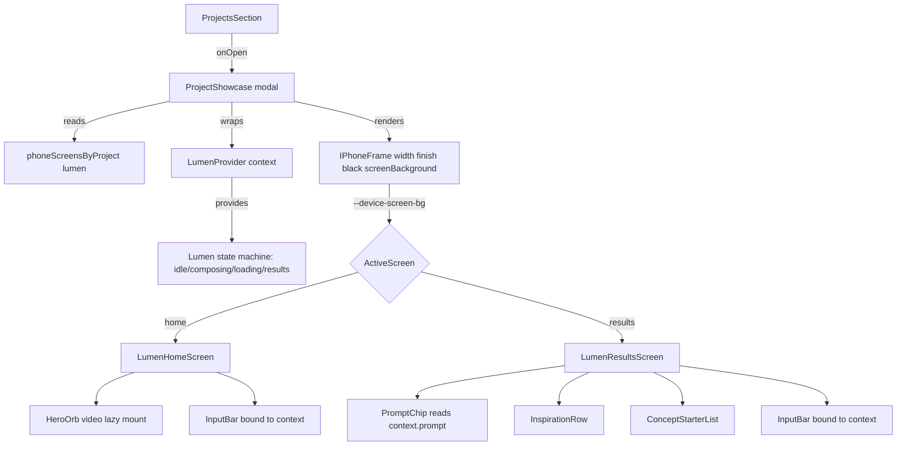
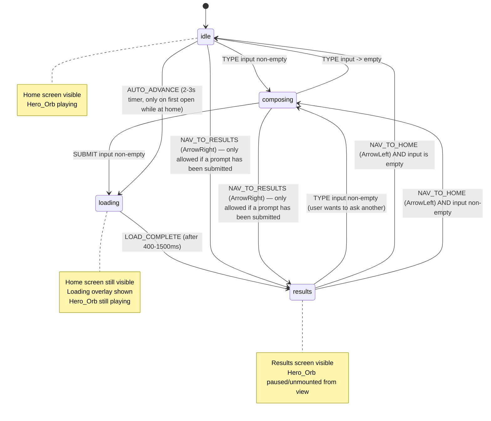
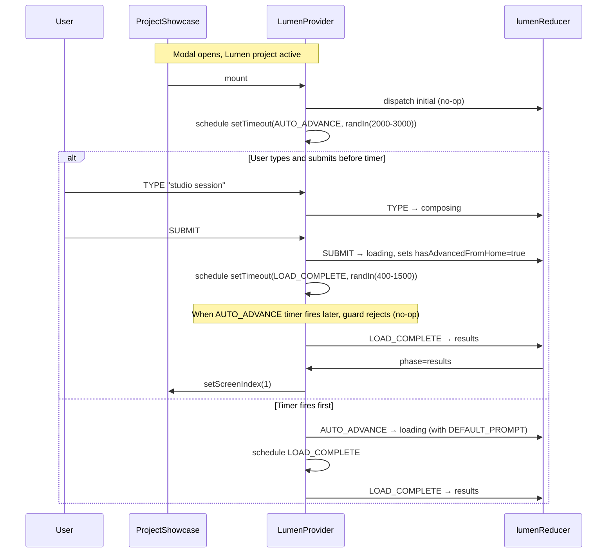
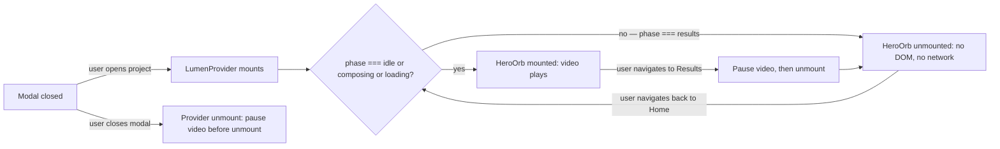

# Design Document — Mobile App Project Showcase (Lumen)

## Overview

This feature replaces the existing `crm` (Lead Management CRM) project with a new mobile app showcase, working name **Lumen** — an AI-powered creative assistant for fashion / motion photography concepts. The deliverable is **two interactive iPhone-frame screens** rendered through the existing `IPhoneFrame` chrome and `ProjectShowcase` modal:

1. **`Lumen_Home_Screen`** — animated liquid-metal hero orb (mp4 video), greeting, heading, bottom-pinned input bar.
2. **`Lumen_Results_Screen`** — prompt chip, "Created in 5 seconds" label, horizontally scrollable inspiration row, numbered concept-starter list, bottom-pinned input bar.

The mockup is **interactive but simulated**: typing a prompt and pressing Enter (or tapping the purple-orb send button) triggers a 400-1500 ms loading state on Home, then transitions to Results. On first open, an automatic Home → Results advance also fires after 2-3 s. There is no backend — the prompt text is stored locally and rendered into the prompt chip.

**Non-goals**

- No real AI calls, network requests, or persistence beyond in-memory React state.
- No new portfolio sections, theming, or tech-stack additions beyond what the new project entry needs.
- No changes to `IPhoneFrame`'s public API; we only consume it.
- No changes to the `chime` project entry, its screens, its registry rows, or its tests.

**Success criteria**

- Visiting the new project card opens the showcase modal with `Lumen_Home_Screen` first; the orb plays; the modal auto-advances to Results in 2-3 s.
- A user can type a prompt, press Enter or tap Send, see a brief loading state, then land on Results with the prompt rendered into the chip.
- `npm run build`, `npm test`, and the existing `screens.test.tsx` pattern continue to pass with new rows for Lumen and CRM rows removed.
- No CRM-prefixed symbols remain anywhere under `src/`.

## Architecture

### Component hierarchy



**Key boundaries**

- `IPhoneFrame` continues to own all device chrome (status bar, Dynamic Island, side buttons, home indicator) and is the **only** writer of the `--device-screen-bg` custom property. The new screens MUST NOT redraw any chrome and MUST consume `var(--device-screen-bg, <fallback>)` for their root background.
- `ProjectShowcase` continues to own modal lifecycle, body-scroll lock, the keyboard handler (Esc / ArrowLeft / ArrowRight), and the carousel `screenIndex`. The new feature **piggybacks** on `screenIndex` rather than introducing a parallel "current screen" state — see "State machine" below.
- The new "Lumen state" (`prompt`, `phase`, `submittedPrompt`) is scoped via React context **rendered inside `ProjectShowcase` only when the active project's id matches the new project**, so the rest of the codebase (and the `chime` project) is unaffected.

### Module layout

A new directory replaces the deleted `crm-screens.tsx`:

```
src/components/portfolio/phone-screens/
├── chime-screens.tsx            (unchanged)
├── crm-screens.tsx              (DELETED)
├── index.tsx                    (registry — drop crm key, add lumen key)
├── screens.test.tsx             (drop crm rows, add lumen rows)
└── lumen-screens/
    ├── index.tsx                (re-exports LumenHomeScreen, LumenResultsScreen)
    ├── lumen-home-screen.tsx    (LumenHomeScreen + HeroOrb)
    ├── lumen-results-screen.tsx (LumenResultsScreen + InspirationRow + ConceptStarterList + PromptChip)
    ├── input-bar.tsx            (shared InputBar + SendButton)
    ├── lumen-context.tsx        (LumenProvider + useLumen hook)
    ├── lumen-machine.ts         (PURE state-machine reducer — no React, exported for PBT)
    ├── lumen-machine.test.ts    (fast-check tests over the reducer)
    └── lumen-data.ts            (concept-starter list, inspiration cards, mp4 source map)
```

Reasoning:

- A **directory per project** scales as Lumen has more components than Chime/CRM and reuses the input bar across two screens. A flat `lumen-screens.tsx` would force a 400-line file with three sub-components and a state machine — splitting it makes both reading and testing easier.
- `lumen-machine.ts` is **framework-agnostic** (no React, no DOM) so it can be tested with fast-check the same way `iphone-frame.helpers.ts` already is. This is the single most important architectural decision for testability.
- The registry (`phone-screens/index.tsx`) imports from `./lumen-screens` (the directory's `index.tsx`), so the public surface used by `ProjectShowcase` does not change — only the implementation behind it.

### mp4 asset delivery strategy

The two mp4 files currently live at `src/assets/`. Next.js (App Router with Turbopack) does **not** serve files in `src/` as static assets — only files under `public/` are served at predictable URLs without bundler intervention. Three options were considered:

| Option | How it works | Pros | Cons |
| --- | --- | --- | --- |
| (a) Move/copy to `public/videos/` | Files become `/videos/lumen-orb-a.mp4` etc. and are served by Next as static files. | Simple, deterministic URL, no bundler magic, browser can cache aggressively, works under Turbopack and webpack identically, works in Vitest (jsdom never fetches the URL anyway). | Slight repo churn — files move from `src/` to `public/`. |
| (b) Static import via Next.js asset loader | `import orb from "../../assets/lumen-orb-a.mp4"` returns a string URL. | No file move; "feels" like an asset. | Next/Turbopack's media-loader behaviour is **not contractually documented for `.mp4`** — it works for images out of the box, but mp4 imports rely on a generic file loader that is currently undocumented for Turbopack. Brittle. |
| (c) Custom webpack/Turbopack rule | Add a file rule for `.mp4` to `next.config.ts`. | Maximum control. | Turbopack does not yet support `webpack` rules; we'd need to maintain dual config. Adds risk. |

**Decision: option (a) — move both mp4 files to `public/videos/`** with descriptive names (`public/videos/lumen-orb-a.mp4`, `public/videos/lumen-orb-b.mp4`). The current opaque hash names (`original-5728764a89b91a8c9a43356a1fd993a1.mp4`) are kept as a copy-step input but renamed in their final location for readability. Rationale: this is the only option that is documented, framework-agnostic, and trivially cacheable with `Cache-Control: public, max-age=31536000` via Next's default static-asset handling. The video URL can then be referenced as a literal string `"/videos/lumen-orb-a.mp4"` from `lumen-data.ts`.

The implementation will pick **one** of the two mp4s as the primary source and reference the other as an `<source>` fallback. The "primary" choice is captured in `lumen-data.ts` as a single exported constant so it can be swapped without touching the screen component.

### State machine for Home → Results

The existing `ProjectShowcase` already drives a `screenIndex` carousel. We need an additional dimension — the **simulated input/loading lifecycle** — that is specific to Lumen.

**Decision: keep `screenIndex` in `ProjectShowcase` (unchanged), introduce a separate `LumenProvider` context that wraps both Lumen screens, and derive the desired `screenIndex` from the Lumen phase via an effect.** The Lumen phase machine lives in pure code (`lumen-machine.ts`) and is consumed by the provider via `useReducer`.

Why this split, rather than hoisting everything into `ProjectShowcase`:

- `ProjectShowcase` is project-agnostic. Adding `composing | loading | results` state to it would couple the modal to one specific project's interaction model. Future projects that need their own state machines would compete with Lumen.
- The Lumen state is meaningful only when the Lumen project is active. When the modal renders Chime, the Lumen provider is not mounted at all.
- Pure reducer = trivial fast-check coverage of "the machine is total" and "empty input never transitions" properties.

**State machine**



**State and event types** (from `lumen-machine.ts`):

```ts
export type LumenPhase = "idle" | "composing" | "loading" | "results";

export type LumenState = {
  phase: LumenPhase;
  /** Live text in the input bar (any phase). */
  input: string;
  /** Last successfully submitted prompt — drives the prompt chip on Results. */
  submittedPrompt: string | null;
  /** True until the first user-driven submit OR auto-advance has fired. */
  hasAdvancedFromHome: boolean;
};

export type LumenEvent =
  | { type: "TYPE"; value: string }
  | { type: "SUBMIT" }
  | { type: "LOAD_COMPLETE" }
  | { type: "AUTO_ADVANCE" }
  | { type: "NAV_TO_HOME" }
  | { type: "NAV_TO_RESULTS" }
  | { type: "RESET" };

export const initialLumenState: LumenState = {
  phase: "idle",
  input: "",
  submittedPrompt: null,
  hasAdvancedFromHome: false,
};

export function lumenReducer(state: LumenState, event: LumenEvent): LumenState;
```

**Transition table** (the function is total — every (state, event) pair has a defined next state, defaulting to the current state when the event is a no-op):

| from `phase` | event             | guard                           | next `phase` | side-effect to state                                                             |
| ------------ | ----------------- | ------------------------------- | ------------ | -------------------------------------------------------------------------------- |
| `idle`       | `TYPE`            | value non-empty after trim      | `composing`  | `input = value`                                                                  |
| `idle`       | `TYPE`            | value empty after trim          | `idle`       | `input = ""`                                                                     |
| `idle`       | `AUTO_ADVANCE`    | `!hasAdvancedFromHome`          | `loading`    | `submittedPrompt = DEFAULT_PROMPT`, `hasAdvancedFromHome = true`                 |
| `idle`       | `AUTO_ADVANCE`    | `hasAdvancedFromHome`           | `idle`       | unchanged                                                                        |
| `idle`       | `SUBMIT`          | always (input is empty here)    | `idle`       | unchanged (Req 5.6 — empty submit is a no-op)                                    |
| `composing`  | `TYPE`            | value non-empty after trim      | `composing`  | `input = value`                                                                  |
| `composing`  | `TYPE`            | value empty after trim          | `idle`       | `input = ""`                                                                     |
| `composing`  | `SUBMIT`          | input non-empty after trim      | `loading`    | `submittedPrompt = input.trim()`, `hasAdvancedFromHome = true`                   |
| `composing`  | `AUTO_ADVANCE`    | always                          | `composing`  | unchanged (user is typing — don't yank them away)                                |
| `loading`    | `LOAD_COMPLETE`   | always                          | `results`    | `input = ""`                                                                     |
| `loading`    | any other         | —                               | `loading`    | unchanged                                                                        |
| `results`    | `TYPE`            | value non-empty after trim      | `composing`  | `input = value`                                                                  |
| `results`    | `TYPE`            | value empty after trim          | `results`    | `input = ""`                                                                     |
| `results`    | `SUBMIT`          | input non-empty after trim      | `loading`    | `submittedPrompt = input.trim()`                                                 |
| `results`    | `SUBMIT`          | input empty                     | `results`    | unchanged                                                                        |
| `results`    | `NAV_TO_HOME`     | always                          | `idle` or `composing` (depending on `input`) | unchanged otherwise                                  |
| any          | `RESET`           | always                          | `idle`       | full reset to `initialLumenState`                                                |
| any          | unknown           | —                               | unchanged    | unchanged                                                                        |

The provider derives the **desired `screenIndex`** from `phase`:

- `phase === "idle" || phase === "composing" || phase === "loading"` → screenIndex 0 (Home).
- `phase === "results"` → screenIndex 1 (Results).

A `useEffect` inside `LumenProvider` calls `setScreenIndex` (passed in via context from `ProjectShowcase`) whenever the desired index changes, so `ProjectShowcase`'s carousel state stays consistent with the Lumen state. Conversely, when `ProjectShowcase` flips `screenIndex` via Arrow keys, the provider observes the change and dispatches `NAV_TO_HOME` / `NAV_TO_RESULTS` so the Lumen phase tracks the carousel.

This bidirectional sync is the trickiest design point; the contract is made explicit in the reducer so PBT can verify it.

### Coordinating auto-advance with simulated loading

The existing `ProjectShowcase` carousel uses a 4500 ms `setInterval` that bumps `screenIndex`. For the Lumen project we have a different requirement (Req 3.7): a **one-shot 2-3 s auto-advance from Home → Results on first open**. Two changes to `ProjectShowcase` are required:

1. **Disable the project-agnostic carousel for Lumen.** The simplest mechanism is a per-project flag on the registry: `phoneScreensByProject[id]` already returns the screens, and we extend it with an optional `autoAdvance: { enabled: boolean; intervalMs: number }` next to the screens array (default `{ enabled: true, intervalMs: 4500 }` when omitted, so Chime is unchanged). For Lumen the registry returns `{ enabled: false }`, suppressing the carousel.

2. **Lumen owns its own one-shot timer.** Inside `LumenProvider`, on mount, schedule a `setTimeout(() => dispatch({ type: "AUTO_ADVANCE" }), randIn(2000, 3000))`. The reducer's guard ignores `AUTO_ADVANCE` if `hasAdvancedFromHome` is already true (i.e. the user pressed Send/Enter first), so user-driven Send and the timer **cannot conflict**: whichever fires first wins, the other becomes a no-op.

The random delay in `[2000, 3000]` ms uses `Math.random()`; in tests we inject a clock and a constant random source through provider props (`now?`, `random?`) so tests are deterministic.

The `loading` phase has a similarly simulated timer: on entry, schedule `setTimeout(() => dispatch({ type: "LOAD_COMPLETE" }), randIn(400, 1500))`. The provider tracks the timer ID in a ref and cancels it on unmount.



### Hero_Orb mount/unmount lifecycle

Requirements 7.1-7.5 mandate lazy load + pause-on-close + pause-on-not-home + `prefers-reduced-motion`.



**Implementation contract for `HeroOrb`:**

- The `<video>` element is rendered **only when** `phase !== "results"`. We don't simply hide it with CSS — Req 7.4 says it must not be playing while Results is active, and unmounting is the cleanest way to enforce that without manual `pause()` choreography.
- The component receives a `videoRef` and an `onPause` callback. On unmount (via the cleanup phase of a `useLayoutEffect`), it calls `videoRef.current?.pause()` synchronously **before** the element is removed from the DOM. This satisfies Req 7.3.
- `preload="metadata"` (Req 7.5) plus `autoPlay`, `muted`, `loop`, `playsInline` (Req 3.4).
- `aria-hidden="true"` because the orb is purely decorative (Req 8.3).
- A `prefers-reduced-motion` fallback shows a static poster image (`` extracted from the first frame, or a `poster` attribute on the video element with the orb paused). To detect the preference safely on the server, we extract a small custom hook `useReducedMotion()` (no equivalent exists today):

  ```ts
  // src/components/portfolio/phone-screens/lumen-screens/use-reduced-motion.ts
  export function useReducedMotion(): boolean {
    // Default to `false` on the server so first paint doesn't downgrade the
    // experience; subscribe in an effect.
    const [reduced, setReduced] = useState(false);
    useEffect(() => {
      if (typeof window === "undefined") return;
      const mql = window.matchMedia("(prefers-reduced-motion: reduce)");
      const handler = () => setReduced(mql.matches);
      handler();
      mql.addEventListener("change", handler);
      return () => mql.removeEventListener("change", handler);
    }, []);
    return reduced;
  }
  ```

  This avoids SSR-mismatch warnings because both server and client first-render with `false`, then the effect upgrades to the real value on the client without changing markup structure (only the inner element of `HeroOrb`).

### Inspiration_Row image strategy

Inspiration cards (Req 4.4 — at least 4) are stored under `public/images/projects/lumen/`:

```
public/images/projects/lumen/
├── insp-01.webp
├── insp-02.webp
├── insp-03.webp
├── insp-04.webp
└── insp-05.webp   (optional, for visual density)
```

**Aspect ratio**: portrait `3:4` (e.g. 240 × 320 source, exported at 2× for retina = 480 × 640). This matches the reference screenshots and is the native ratio of the result-card thumbnails seen in the design.

**Layout**: a flex row inside an overflow container:

```tsx
<div
  className="-mx-4 overflow-x-auto px-4 [scrollbar-width:none] [&::-webkit-scrollbar]:hidden"
  style={{ scrollSnapType: "x mandatory" }}
>
  <ul className="flex gap-3">
    {inspiration.map((card) => (
      <li
        key={card.id}
        className="relative shrink-0 overflow-hidden rounded-2xl"
        style={{ width: 132, aspectRatio: "3 / 4", scrollSnapAlign: "start" }}
      >
        <Image
          src={card.src}
          alt={card.alt}
          fill
          sizes="132px"
          className="object-cover"
        />
      </li>
    ))}
  </ul>
</div>
```

Reasoning:

- **Fixed pixel width per card** (`width: 132`) plus `aspectRatio: "3 / 4"` — Next.js `Image` with `fill` requires a positioned parent with intrinsic dimensions, and a fixed width (rather than `flex-1`) prevents layout shift when scrolled or when images lazy-load.
- **`sizes="132px"`** lets Next pick the right responsive variant.
- **`object-cover`** crops gracefully when source assets vary slightly in ratio.
- **`-mx-4 px-4`** allows the row to bleed to the screen edge while keeping the inner content padded to match the rest of the screen — a common iOS pattern (the screenshots show partial cards peeking off-screen).
- **`scroll-snap-type: x mandatory`** gives a subtle "feels native" snap when the user flicks horizontally.
- The phone screen width (passed by `IPhoneFrame`) is in the `~280-440 px` range, so 132 px cards put roughly 2.2 cards visible at a time, matching the screenshots.

### Visual styling map

The design tokens captured from the screenshots, translated to Tailwind utility patterns:

| Token | Value | Tailwind / inline style |
| --- | --- | --- |
| Screen background (off-white) | `#f8f6f2` | Registry `screenBackground: "#f8f6f2"`; root: `style={{ background: "var(--device-screen-bg, #f8f6f2)" }}` |
| Greeting text "Hey Martin," | warm grey, 13-14 px, medium | `text-[13px] font-medium text-black/55 tracking-[-0.005em]` |
| Heading "What can I help with?" | serif display, 28-32 px, regular weight | `font-serif text-[30px] leading-[1.1] tracking-[-0.02em] text-[#2a2724]` (uses `font-serif` from the default Tailwind family stack — adequate fallback to system serif since we're not loading a custom serif font) |
| Prompt chip on Results | pill, soft cream/translucent fill, dark text | `rounded-full px-3 py-1.5 text-[12px] font-medium text-[#2a2724] bg-[#efece6]/80 backdrop-blur-sm` |
| "Created in 5 seconds" label | uppercase tracking, very small, muted | `text-[10px] uppercase tracking-[0.12em] text-black/45` |
| Concept-starter list ordinals | tabular numerals, dark, bold | `tabular-nums font-semibold text-[13px] text-[#2a2724]` |
| Concept-starter list items | medium weight, dark with subtle separator | `font-medium text-[14px] text-[#2a2724]` ; rows separated by `border-t border-black/[0.06]` |
| Input bar container (glass) | rounded-full, translucent white, soft shadow, blur | `liquid-glass rounded-full pl-4 pr-1 py-1` (existing class in `globals.css`) |
| Input field | placeholder muted, no border, transparent bg | `flex-1 bg-transparent text-[13px] text-[#2a2724] placeholder:text-black/35 focus:outline-none` |
| Send button (purple orb) | small circular, purple gradient, white glyph | `grid size-7 place-items-center rounded-full text-white` ; `background: "radial-gradient(circle at 30% 25%, #b89cff 0%, #7d4bff 55%, #4d24c5 100%)"` ; `box-shadow: "inset 0 1px 0 rgba(255,255,255,0.45), 0 4px 12px -2px rgba(125,75,255,0.45)"` |
| Send glyph | up-arrow or paper-plane, 12 px | inline SVG, stroke `currentColor` |
| Focus ring (Req 5.2) | `outline: 2px solid rgba(125,75,255,0.6); outline-offset: 2px` on the input wrapper when input focused | applied via `:focus-within` on the glass container |

These tokens are gathered into a single styling object in `lumen-screens/styles.ts` (small) so the same purple-gradient token is reused by both screen's input bars without copy-paste drift.

## Components and Interfaces

### `lumenReducer` (pure state machine)

```ts
// src/components/portfolio/phone-screens/lumen-screens/lumen-machine.ts

/** Default prompt used when the auto-advance timer fires before the user types anything. */
export const DEFAULT_PROMPT = "Inspiration for motion fashion photography";

export type LumenPhase = "idle" | "composing" | "loading" | "results";

export type LumenState = {
  phase: LumenPhase;
  input: string;
  submittedPrompt: string | null;
  hasAdvancedFromHome: boolean;
};

export type LumenEvent =
  | { type: "TYPE"; value: string }
  | { type: "SUBMIT" }
  | { type: "LOAD_COMPLETE" }
  | { type: "AUTO_ADVANCE" }
  | { type: "NAV_TO_HOME" }
  | { type: "NAV_TO_RESULTS" }
  | { type: "RESET" };

export const initialLumenState: LumenState;

export function lumenReducer(state: LumenState, event: LumenEvent): LumenState;

/** Pure helper used by tests and by the provider effect. */
export function isInputSubmittable(input: string): boolean; // = input.trim().length > 0
```

The reducer's contract:

- Total: every (state, event) pair returns some valid state.
- Idempotent on no-op events (returns the SAME reference when state would not change — important so React's `useReducer` skips re-renders).
- Pure: no `Date.now()`, no `Math.random()`, no I/O.

### `LumenProvider` and `useLumen` context

```ts
// src/components/portfolio/phone-screens/lumen-screens/lumen-context.tsx

export type LumenContextValue = {
  state: LumenState;
  setInput: (value: string) => void;        // dispatches TYPE
  submit: () => void;                       // dispatches SUBMIT
  navigateToHome: () => void;               // dispatches NAV_TO_HOME
  navigateToResults: () => void;            // dispatches NAV_TO_RESULTS
  reset: () => void;                        // dispatches RESET
};

export type LumenProviderProps = {
  children: React.ReactNode;
  /** Externally controlled carousel index from ProjectShowcase. */
  screenIndex: number;
  setScreenIndex: (index: number) => void;
  /** Test seams. */
  randomSource?: () => number;              // defaults to Math.random
  scheduler?: {
    setTimeout: typeof window.setTimeout;
    clearTimeout: typeof window.clearTimeout;
  };
};

export const useLumen: () => LumenContextValue;
```

### `LumenHomeScreen`

```ts
// lumen-home-screen.tsx
export function LumenHomeScreen(): JSX.Element;
```

Responsibilities:

- Renders the **off-white root container** with `style={{ background: "var(--device-screen-bg, #f8f6f2)" }}` (Req 6.1).
- Renders greeting, heading, `<HeroOrb />` (only when `phase !== "results"`), and `<InputBar />`.
- Reads `state.phase` from `useLumen()`; while `phase === "loading"`, overlays a small loading indicator (a centered shimmer dot trio with a translucent backdrop) over the orb area (Req 5.5).

### `LumenResultsScreen`

```ts
// lumen-results-screen.tsx
export function LumenResultsScreen(): JSX.Element;
```

Responsibilities:

- Renders the off-white root container with the same `var(--device-screen-bg, #f8f6f2)` convention (Req 6.2).
- Renders `<PromptChip text={state.submittedPrompt ?? DEFAULT_PROMPT} />`, "Created in 5 seconds" label, `<InspirationRow />`, `<ConceptStarterList />`, `<InputBar />`.
- Middle region between chip and input bar uses `flex-1 overflow-y-auto` so the concept list can scroll while the chip and input bar stay pinned (Req 4.7).

### `InputBar`

```ts
// input-bar.tsx
export function InputBar(): JSX.Element;
```

Responsibilities:

- Reads `state.input` and `setInput` / `submit` from `useLumen()`.
- Renders a `<form>` so pressing Enter naturally submits without manual `keydown` handling (Req 5.3). The form's `onSubmit` calls `event.preventDefault()` and `submit()`.
- Renders `<input type="text" placeholder="Ask anything..." aria-label="Ask anything" />` and a `<button type="submit" aria-label="Send">` containing the purple-orb send glyph.
- Tab order is enforced by source order: the input is first, the button is second (Req 8.4). Neither element sets `tabIndex`.
- Focus ring uses `:focus-within` on the wrapper so the entire glass pill highlights when either child has focus (Req 5.2).
- `submit()` is a no-op when `state.input.trim() === ""` (the reducer guards this; the button does not need to be `disabled`, which would prevent it from being focusable for tab-order assertions).
- On click, the send button plays a 200 ms scale press animation via Framer Motion `whileTap={{ scale: 0.92 }}` (Req 5.7).

### `HeroOrb`

```ts
// inside lumen-home-screen.tsx
function HeroOrb(): JSX.Element;
```

Responsibilities:

- Calls `useReducedMotion()`; renders an `` poster fallback when reduced motion is preferred (Req 3.6) and a `<video>` element otherwise (Req 3.4).
- The `<video>` has `muted`, `autoPlay`, `loop`, `playsInline`, `preload="metadata"`, `aria-hidden="true"`, and `<source src="/videos/lumen-orb-a.mp4" type="video/mp4" />`.
- On unmount, `useLayoutEffect` cleanup pauses the element before the DOM node detaches (Req 7.3).
- Returns `null` (renders nothing) if the host says the video should not be present — but in our wiring, `LumenHomeScreen` only renders `HeroOrb` while `phase !== "results"`, so the component itself does not need to read phase.

### Registry shape change

`PhoneScreen` gains no new fields; the registry shape is augmented at the *project* level:

```ts
// phone-screens/index.tsx

export type PhoneScreen = { id: string; label: string; Component: ComponentType; screenBackground: string };

export type PhoneScreenProjectEntry = {
  screens: PhoneScreen[];
  /** Carousel auto-advance behaviour. */
  autoAdvance: { enabled: boolean; intervalMs: number };
};

export const phoneScreensByProject: Record<string, PhoneScreenProjectEntry> = {
  chime: {
    screens: [/* unchanged */],
    autoAdvance: { enabled: true, intervalMs: 4500 },
  },
  lumen: {
    screens: [
      { id: "home", label: "Home", Component: LumenHomeScreen, screenBackground: "#f8f6f2" },
      { id: "results", label: "Results", Component: LumenResultsScreen, screenBackground: "#f8f6f2" },
    ],
    autoAdvance: { enabled: false, intervalMs: 0 },
  },
};
```

`ProjectShowcase` is updated to read `phoneScreensByProject[id]?.screens` and `phoneScreensByProject[id]?.autoAdvance` separately (one extra field, two-line code change). To **avoid breaking the existing `project-showcase.test.tsx`**, the test's CRM row is dropped and a Lumen row is added (see Testing Strategy).

> **Migration note:** the previous registry was `Record<string, PhoneScreen[]>`. Existing call sites in `ProjectShowcase` that wrote `phoneScreensByProject[project.id] ?? []` change to `phoneScreensByProject[project.id]?.screens ?? []`. Only `ProjectShowcase` and the registry itself read the registry today (verified via grep), so the surface area is small.

## Data Models

### Lumen project entry (`portfolio-data.ts`)

```ts
{
  id: "lumen",
  title: "Lumen",
  subtitle: "AI Creative Assistant",
  description:
    "Concept ideation for fashion and motion photographers — generate moodboards, hooks, and shot lists from a one-line prompt. Designed in iOS-native idiom with a custom liquid-metal hero animation.",
  image: "/images/projects/lumen/cover.webp",
  links: {
    site: "https://lumen-app.example.com",   // placeholder, may be omitted if not live
    github: "https://github.com/dheeraj3587/lumen",
  },
  stack: ["typescript", "react", "ai", "figma"],
}
```

`ai` is **already** present in `public/icons/tech/ai.svg` but is not yet a registered tech id — it must be added to `projectOnlyTech` so `techById.get("ai")` resolves (Req 1.5). Same for any other id not already in the registry (e.g. `nextjs2-dark` if used). Concretely, append to `projectOnlyTech`:

```ts
{ id: "ai", name: "AI", src: "/icons/tech/ai.svg" },
```

`react` is already in `techStack`. `typescript` is already in `techStack`. `figma` is already in `projectOnlyTech`.

The `image` value (`/images/projects/lumen/cover.webp`) is a new asset; for the initial implementation we may reuse `preview_2.webp` until a final cover is produced.

### Concept-starter list

Static array exported from `lumen-data.ts`:

```ts
export const conceptStarters: ReadonlyArray<{ id: string; title: string }> = [
  { id: "velocity-veil",   title: "Velocity Veil" },
  { id: "skate-tailored",  title: "Skate-Tailored" },
  { id: "rain-room-glam",  title: "Rain Room Glam" },
  { id: "neon-monsoon",    title: "Neon Monsoon" },   // 4th (Req 4.5)
];
```

The first three are required by Req 4.5 and must be in the order shown. The 4th is design-flex and can be edited freely.

### Inspiration cards

```ts
export const inspirationCards: ReadonlyArray<{
  id: string;
  src: string;
  alt: string;
}> = [
  { id: "insp-01", src: "/images/projects/lumen/insp-01.webp", alt: "Motion blur runway shot" },
  { id: "insp-02", src: "/images/projects/lumen/insp-02.webp", alt: "Rainwear backlit portrait" },
  { id: "insp-03", src: "/images/projects/lumen/insp-03.webp", alt: "Skate-fashion editorial" },
  { id: "insp-04", src: "/images/projects/lumen/insp-04.webp", alt: "Studio lighting study" },
  // optional 5th and beyond
];
```

Minimum 4 entries (Req 4.4). Until the real assets are produced, placeholders the same dimension can be used.

### Hero_Orb video sources

```ts
export const heroOrbVideoSources: ReadonlyArray<string> = [
  "/videos/lumen-orb-a.mp4",
  "/videos/lumen-orb-b.mp4",
];
export const HERO_ORB_PRIMARY = heroOrbVideoSources[0];
```

`HERO_ORB_PRIMARY` is the file referenced by `<source>`; the second is kept available for future A/B selection but is not loaded by default.

### Timing constants

```ts
export const TIMING = {
  AUTO_ADVANCE_MIN_MS: 2000,
  AUTO_ADVANCE_MAX_MS: 3000,
  LOADING_MIN_MS:       400,
  LOADING_MAX_MS:      1500,
  SEND_PRESS_MS:        200,   // Req 5.7 (≤ 250ms)
} as const;
```

## Correctness Properties


*A property is a characteristic or behavior that should hold true across all valid executions of a system — essentially, a formal statement about what the system should do. Properties serve as the bridge between human-readable specifications and machine-verifiable correctness guarantees.*

The properties below are the consolidated, non-redundant set derived from the prework analysis. Each is universally quantified, traceable to one or more requirements clauses, and implementable as either a fast-check property over the pure reducer / data layer, or an invariant-style render assertion that iterates over the registry.

### Property 1: Project identifier invariants

*For all* projects `p` in the `projects` array exported from `src/lib/portfolio-data.ts`, `p.id !== "crm"`, and there exists exactly one `p` with the new Lumen project id, and all `p.id` values are pairwise distinct.

**Validates: Requirements 1.1, 1.2, 1.6**

### Property 2: Stack identifiers resolve via `techById`

*For all* projects `p` in the `projects` array, *for all* stack identifiers `id` in `p.stack`, `techById.get(id)` returns a defined `TechItem`. This must hold after the new project is added and any required ids have been appended to `projectOnlyTech`.

**Validates: Requirements 1.4, 1.5**

### Property 3: Every registered screen consumes the `--device-screen-bg` convention

*For all* projects in `phoneScreensByProject` and *for all* `screen` in that project's `screens` array, both of the following hold:

1. `tryParseHexOrRgb(screen.screenBackground)` returns a non-null `{ r, g, b }` triple (i.e. the value is hex or rgb, never a gradient or `oklch`/`var()` token).
2. Rendering `<screen.Component />` produces a root element whose inline `style.background` is exactly the literal string `` `var(--device-screen-bg, ${screen.screenBackground})` ``.

**Validates: Requirements 2.5, 3.1, 4.1, 6.1, 6.2**

### Property 4: Screens render no device chrome

*For all* `screen` registered for the Lumen project, rendering `<screen.Component />` produces a DOM tree that contains zero elements matching any of the device-chrome selectors:

- `[data-iphone-button]` (side buttons)
- `[data-device-screen]` (the screen container is owned by `IPhoneFrame`, never by a screen child)
- `<svg>` glyphs from the `StatusBar`'s SignalGlyph / WifiGlyph / BatteryGlyph (asserted by class / structural absence)
- An element styled as the home-indicator pill (a `width: 32%`, `height: ~3px`, `border-radius: 999px` element near the bottom)

**Validates: Requirements 3.9, 4.8**

### Property 5: `lumenReducer` is total

*For all* `state: LumenState` reachable from `initialLumenState` via any sequence of `LumenEvent` values, *and for all* `event: LumenEvent`, `lumenReducer(state, event)` returns a `LumenState` whose `phase` ∈ `{"idle", "composing", "loading", "results"}` and whose `input`, `submittedPrompt`, and `hasAdvancedFromHome` fields satisfy their declared types. The reducer never throws and never returns `undefined`. This is the structural foundation that makes the other reducer-based properties well-defined.

**Validates: Requirements 5.3, 5.4, 5.6**

### Property 6: `SUBMIT` with non-empty input advances to `results` carrying the trimmed prompt

*For all* `s: string` such that `s.trim().length > 0`, the event sequence

```
TYPE(s) → SUBMIT → LOAD_COMPLETE
```

applied starting from `initialLumenState` (or any state with `phase ∈ {"idle", "composing", "results"}`) ends in a state with `phase === "results"`, `submittedPrompt === s.trim()`, and `hasAdvancedFromHome === true`. Furthermore, the intermediate state after `SUBMIT` has `phase === "loading"`.

**Validates: Requirements 5.3, 5.4, 4.2**

### Property 7: Empty or whitespace-only input never advances the phase

*For all* strings `s` such that `s.trim().length === 0`, *and for all* states `state: LumenState`, applying the event sequence `TYPE(s) → SUBMIT` returns a final state with `phase ∈ {"idle", "results"}` (specifically not `"loading"`) and `submittedPrompt` unchanged from `state.submittedPrompt`. The pre-existing `phase` is preserved when it is `idle` or `results`; from `composing`, the empty `TYPE` collapses back to `idle`.

**Validates: Requirements 5.6**

### Property 8: `HeroOrb` is mounted if and only if the phase is not `results`

*For all* states `state: LumenState`, the `HeroOrb` component is rendered in the DOM (queryable as `<video aria-hidden="true">`) if `state.phase !== "results"`, and is *not* rendered if `state.phase === "results"`. Equivalently: rendering `<LumenHomeScreen />` inside a `LumenProvider` parameterised by `state` produces a DOM tree where `document.querySelectorAll("video").length === (state.phase === "results" ? 0 : 1)`. Indirectly this also covers Requirement 7.1 when the modal-closed condition is mapped to "provider unmounted".

**Validates: Requirements 7.1, 7.4**

### Property 9: Auto-advance fires at most once, only within the 2000-3000 ms window, and only when no user submission has occurred

*For all* delays `d ∈ [2000, 3000]` and *for all* event sequences `E` containing zero `SUBMIT` events with non-empty input, applying the timer-driven event `AUTO_ADVANCE` after virtual time `d` (with no user `SUBMIT` having fired) transitions `phase` from `idle` to `loading` exactly once and sets `hasAdvancedFromHome = true`. Any subsequent `AUTO_ADVANCE` event is a no-op (the reducer's guard rejects it). If a user `SUBMIT` with non-empty input fires before time `d`, the later `AUTO_ADVANCE` is also a no-op.

**Validates: Requirements 3.7**

## Error Handling

The feature is a UI mockup with no network or persistence layer; the failure modes are narrow and mostly involve degraded-but-safe rendering.

### Asset failures

| Failure | Handling |
| --- | --- |
| `lumen-orb-a.mp4` 404 / decode error | The `<video>` element fires an `error` event. We attach `onError` that swaps the `<video>` for the static poster `` (same fallback path as `prefers-reduced-motion`). The user sees a still orb instead of a broken element. |
| Inspiration card image 404 | `<Image fill>` shows its blurred placeholder; the alt text remains accessible. No error logged. |
| Cover image 404 (`/images/projects/lumen/cover.webp`) | The existing `ProjectCard` already uses `next/image` with `fill`; a 404 produces a blank tile. We will commit a real (or placeholder) cover image as part of the implementation so this never fires in practice. |

### State-machine misuse

The reducer is total, so unknown events are no-ops. There is no error path: every (state, event) pair yields a valid `LumenState`. This is enforced by Property 5 (totality).

### Timer / scheduler failures

`setTimeout` cannot fail in a way that throws. If the host page tab is backgrounded, browsers may throttle timers — that's acceptable for this mockup. The provider's cleanup phase always calls `clearTimeout` on the stored ref to avoid stray dispatches after unmount; this is a memory-leak hygiene check rather than an error path.

### Reduced-motion detection

`window.matchMedia` is missing in some non-browser environments (e.g. SSR). The `useReducedMotion` hook guards on `typeof window === "undefined"` and returns `false` until the client effect runs, so SSR never throws.

### Modal lifecycle

Existing `ProjectShowcase` cleanup (body-scroll lock restore, keydown listener removal) continues to apply. The new `LumenProvider` registers its own cleanup for timers and video pause-before-unmount; both are idempotent and safe to call when the modal closes mid-transition.

## Testing Strategy

### Tools

- **Unit + integration tests**: Vitest (`vitest run`), `@testing-library/react`, `@testing-library/user-event`, jsdom.
- **Property-based tests**: `fast-check` v4 (already a dev dependency, used in `iphone-frame.helpers.test.ts`).
- **No new test runners** — we extend the existing matrix.

### Test files

| File | What it covers |
| --- | --- |
| `src/components/portfolio/phone-screens/screens.test.tsx` | **Modified**: drop the three CRM rows, add `LumenHomeScreen` and `LumenResultsScreen` rows asserting `style.background === "var(--device-screen-bg, #f8f6f2)"`. Keeps the existing Chime rows. (Req 9.1-9.4) |
| `src/components/portfolio/project-showcase.test.tsx` | **Modified**: replace the `crm` case with `lumen` so the "active screen → IPhoneFrame `--device-screen-bg`" integration test continues to cover both shipped projects. (Req 6.5, 6.6) |
| `src/components/portfolio/phone-screens/lumen-screens/lumen-machine.test.ts` | **New**: pure-reducer fast-check tests for Properties 5, 6, 7, 8, 9. |
| `src/components/portfolio/phone-screens/lumen-screens/registry.test.ts` | **New**: invariant tests over `phoneScreensByProject` and `projects` for Properties 1, 2, 3, 4. |
| `src/components/portfolio/phone-screens/lumen-screens/lumen-screens.test.tsx` | **New**: render-level integration tests for example-classified criteria — text content (3.2, 4.3, 4.5), input behaviour (5.1, 5.7), accessibility (8.1, 8.2, 8.3, 8.4), HeroOrb attributes (3.4, 7.5), reduced-motion fallback (3.6), HeroOrb pause-on-unmount (7.3), modal-closed = no video (7.1). |

### Property-test conventions

Each property test:

1. **Runs ≥ 100 iterations** (`{ numRuns: 100 }` is fast-check's default; we make it explicit).
2. **Tags the test name** with the format `**Feature: mobile-app-project-showcase, Property N: <text>**` in a top-of-`it` comment, matching the existing convention in `iphone-frame.helpers.test.ts`.
3. **Generators**:
   - `LumenEvent` events: `fc.oneof` over each variant constructor.
   - `LumenState`: a derived arbitrary that plays a random sequence of events from `initialLumenState`, ensuring only reachable states are tested.
   - `prompt` strings: `fc.string()` for unrestricted; `fc.string().filter(s => s.trim().length > 0)` for "non-empty"; `fc.string({ unit: fc.constantFrom(" ", "\t", "\n") })` for "whitespace-only".
   - `delay`: `fc.integer({ min: 2000, max: 3000 })` for auto-advance, `{ min: 400, max: 1500 }` for loading.

Example skeleton for Property 7 (empty input never advances):

```ts
import fc from "fast-check";
import { describe, it, expect } from "vitest";
import { lumenReducer, initialLumenState } from "./lumen-machine";

// Feature: mobile-app-project-showcase
// Property 7: Empty or whitespace-only input never advances the phase
describe("Property 7 — empty input never advances", () => {
  const whitespaceOnly = fc.string({ unit: fc.constantFrom(" ", "\t", "\n", "") });

  it("for all whitespace-only inputs s, TYPE(s) then SUBMIT keeps phase ∉ {loading}", () => {
    fc.assert(
      fc.property(whitespaceOnly, (s) => {
        const afterType = lumenReducer(initialLumenState, { type: "TYPE", value: s });
        const afterSubmit = lumenReducer(afterType, { type: "SUBMIT" });
        expect(afterSubmit.phase).not.toBe("loading");
        expect(afterSubmit.submittedPrompt).toBe(initialLumenState.submittedPrompt);
      }),
      { numRuns: 100 },
    );
  });
});
```

### Render-test conventions

Render tests for properties that involve the DOM (Properties 3, 4, 8):

- Iterate over `Object.values(phoneScreensByProject).flatMap(p => p.screens)` rather than hard-coding component identities, so any future screen automatically participates in the invariant.
- For Property 4 (no chrome), render the screen *outside* `IPhoneFrame` so any chrome present in the output must have been drawn by the screen itself (which is the regression we want to catch).
- For Property 8 (HeroOrb iff not results), drive the render via the `LumenProvider`'s exposed test seam: the provider accepts a controlled `phase` (or we mount it and dispatch events). The simpler test path is to render `<LumenHomeScreen />` inside a provider whose initial state is parameterised, then iterate over all four phases.

### Smoke tests

These are out-of-band but tracked in tasks:

- `npm run build` succeeds with no module-not-found error referencing `crm-screens` (Req 10.3).
- `npx vitest run src/components/portfolio/phone-screens/screens.test.tsx` passes (Req 9.4).
- `grep -rn "crm" src/` returns zero matches except inside the new design / requirements docs themselves (Req 1.6, 10.2).

### What we explicitly do NOT property-test

- **Visual layout / pixel positioning** — jsdom has no real layout engine. Layout requirements (3.3, 3.8, 4.6, 6.3, 6.4) are covered by structural DOM-order assertions and class-presence checks, not measurement.
- **Network performance** (Req 7.2's 500 ms mount budget) — measured manually in the browser; not enforced in CI.
- **WCAG contrast for the focus ring** (Req 5.2) — manually validated using DevTools or a contrast-checker browser extension; the property infrastructure for sub-pixel contrast verification would be disproportionate to the surface.
- **Real video playback** — jsdom does not implement HTMLMediaElement playback. We assert mount/attribute presence and rely on a manual smoke check for actual playback.

## Backwards Compatibility & Cleanup

### Files / symbols deleted

- `src/components/portfolio/phone-screens/crm-screens.tsx` — entire file.
- The `crm` key (and its three `PhoneScreen` entries) in `phoneScreensByProject` (now `Record<string, PhoneScreenProjectEntry>`).
- The `crm` project entry in the `projects` array in `src/lib/portfolio-data.ts`.
- All CRM-named imports and test rows in `src/components/portfolio/phone-screens/screens.test.tsx` (`CrmDashboard`, `CrmPipeline`, `CrmLead`).
- The `{ projectId: "crm" as const }` row in `src/components/portfolio/project-showcase.test.tsx` (replaced by `{ projectId: "lumen" as const }`).
- The string `"Built Lead CRM"` in `src/components/portfolio/intro-data.ts`'s scroll-text content (Req 1.6 — replaced by a Lumen reference such as `"Built Lumen"`).
- The `mp4` files at `src/assets/original-5728764a89b91a8c9a43356a1fd993a1.mp4` and `src/assets/original-5c02a7f9fbc7d094fe648f0afc795028.mp4` (after copying / renaming to `public/videos/`).

### What is preserved unchanged

- The `chime` project entry in `portfolio-data.ts`, including `id`, `title`, `subtitle`, `description`, `image`, `links`, `stack`.
- The `chime` registry rows in `phoneScreensByProject` (id, label, Component, screenBackground), wrapped in the new `{ screens, autoAdvance }` envelope but with byte-identical `screens` content.
- The Chime test rows in `screens.test.tsx`.
- `src/components/portfolio/phone-screens/chime-screens.tsx` — entire file.
- The `IPhoneFrame` API surface (`IPhoneFrameProps`, `--device-screen-bg`, status-bar tint resolution, side buttons, home indicator).
- `src/components/ui/iphone-frame.helpers.ts` and its test file — no edits.
- The `ProjectShowcase` modal's keyboard handling (Esc / ArrowLeft / ArrowRight) and body-scroll lock.
- Any tech ids in `techStack` that are unrelated to Lumen.

### What is structurally changed but compatible

- `phoneScreensByProject` shape changes from `Record<string, PhoneScreen[]>` to `Record<string, { screens: PhoneScreen[]; autoAdvance: { enabled: boolean; intervalMs: number } }>`. The only consumers are `ProjectShowcase` (one read site, updated to `entry?.screens`) and `project-showcase.test.tsx` / `screens.test.tsx` (updated). External callers do not exist (verified by grep).
- `next.config.ts` is unchanged. (The decision to use `public/videos/` avoids any webpack/Turbopack rule changes.)

### Migration order

The implementation should follow this order to keep the working tree compilable at every commit boundary:

1. Add the new mp4 files to `public/videos/` (without yet touching `src/assets/`).
2. Add the new `lumen-screens/` directory and pure helpers (`lumen-machine.ts`, `lumen-data.ts`, `use-reduced-motion.ts`).
3. Add the new `LumenHomeScreen`, `LumenResultsScreen`, `LumenProvider`, `InputBar`, `HeroOrb` components.
4. Add the new project entry to `portfolio-data.ts` (Lumen entry added, CRM entry not yet removed) — both projects show in the grid temporarily.
5. Update `phoneScreensByProject` shape; add `lumen` entry; keep `crm` entry temporarily.
6. Update `ProjectShowcase` to consume the new shape and to suppress its 4500 ms carousel when `autoAdvance.enabled === false`.
7. Update tests (`screens.test.tsx`, `project-showcase.test.tsx`) to add Lumen rows.
8. **Now remove**: the `crm` project entry, the `crm` registry key, the `crm-screens.tsx` file, CRM rows in tests, `"Built Lead CRM"` in intro-data, the legacy mp4 files in `src/assets/`.
9. Run `npm run build`, `npm test`, and a manual visual check.

## Open Design Questions

These have been resolved in this document but are flagged for the implementation reviewer:

1. **Default prompt on auto-advance.** When the 2-3 s timer fires before the user types, the reducer uses `DEFAULT_PROMPT = "Inspiration for motion fashion photography"` (matches Req 4.2's example chip text). This is captured in `lumen-data.ts`.

2. **Random source seam.** `LumenProvider` accepts an optional `randomSource: () => number` prop (defaulting to `Math.random`) so timer durations can be made deterministic in tests without mocking `Math.random` globally.

3. **Order of mp4 sources.** Only `lumen-orb-a.mp4` is referenced in production. `lumen-orb-b.mp4` is committed as a backup but unused by default — switching the primary requires a one-line change in `lumen-data.ts`.

4. **Cover image.** Until a final cover is delivered, `image` in the project entry can reuse `/images/projects/preview_2.webp` (the previous CRM cover) without violating any acceptance criterion. The replacement is a one-line diff in `portfolio-data.ts`.

5. **Tech-stack additions.** Only `ai` needs adding to `projectOnlyTech` (Req 1.5). The chosen stack `["typescript", "react", "ai", "figma"]` keeps the cards visually consistent with Chime's 5-icon pattern.
